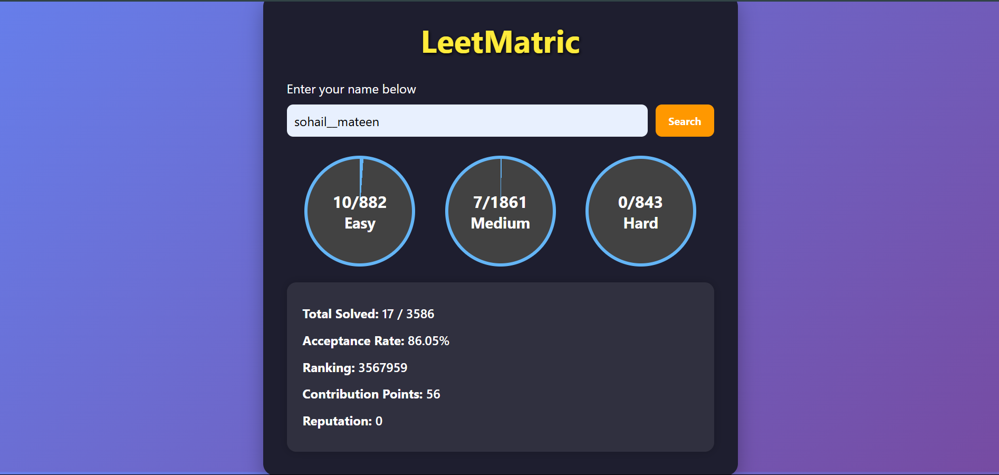

# 🚀 LeetVista – Visualize Your LeetCode Journey

**LeetVista** is a clean and interactive web application that allows users to fetch and visualize their **LeetCode statistics** just by entering a username. Ideal for coders who want to track their problem-solving progress in a visually appealing way.

---

## 🌐 Live Demo

🔗 [Click here to try LeetVista](https://sohailmateen.github.io/LeetMatric/)  

---

## 📸 Preview

  

---

## ✨ Features

- 🔍 **Search any LeetCode user** by username  
- 📊 **Displays**:
  - Total Questions Solved
  - Acceptance Rate
  - User Ranking
  - Contribution Points
  - Reputation
- 🟢🟡🔴 **Visual Progress Circles** for:
  - Easy Problems
  - Medium Problems
  - Hard Problems
- 📱 **Fully Responsive Design**
- ⚠️ **Real-time Input Validation** for invalid/empty usernames  
- 💡 **User-Friendly UI with Smooth Interactions**

---

## 🔧 Tech Stack

- 💻 **HTML5** – Markup & structure  
- 🎨 **CSS3** – Styling and design  
- ⚙️ **Vanilla JavaScript** – Logic and API integration  
- 🔌 **LeetCode Stats API** – [https://leetcode-stats-api.herokuapp.com](https://leetcode-stats-api.herokuapp.com)

---

## 🛠️ Setup Instructions

To run this project locally:

1. **Clone the repository**
   ```bash
   git clone https://github.com/yourusername/leetvista.git
   cd leetvista

2 **Open the project**

    Open index.html in your browser
    (No additional setup required – it's 100% front-end)